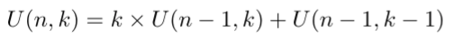
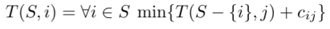
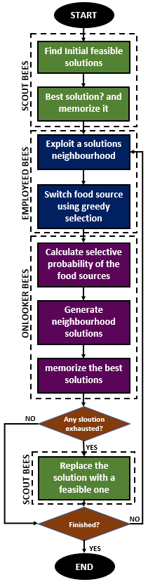
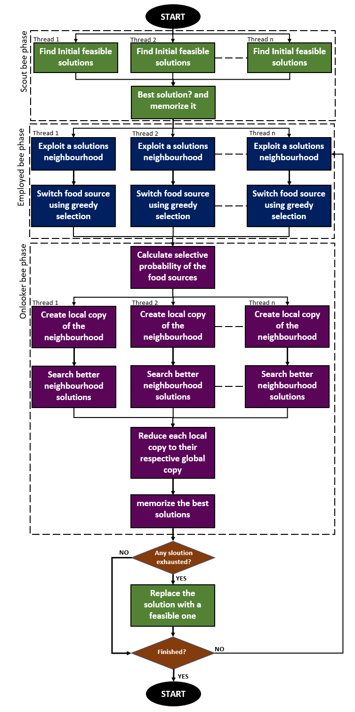

# Introduction

Capacitated Vehicle Routing Problem(CVRP) is a combinatorial problem. CVRP is a NP-Hard problem and the goal of the problem is that for a given set of customers with a set of demands and a fleet of vehicles with their respective capacities, find the most optimal route for all the vehicles such that the demands of all the customers are satisfied maintaining the capacity constraint of all the vehicles \cite{wiki:CVRP}. This paper presents multiple approaches for solving the capacitated vehicle routing problem. It first explains an exact approach which combines the subset partition problem and the traveling salesman problem, then an approximate algorithm which is the Artificial Bee colony algorithm, the paper also presents a parallel architecture of the Artificial Bee Colony algorithm. Finally, a comparative study comparing and contrasting the runtime of all the approaches on datasets of various sizes is presented.

# Dataset

 The dataset used for this paper is the capacitated vehicle routing problem (CVRP) dataset from [BranchAndCut.org](https://www.coin-or.org/SYMPHONY/branchandcut/VRP/data/index.htm.old) .It has ∼107 files for CVRP problem.

 # Exact algorithm

 The exact algorithm for the problem is divided into two parts. The first part will find all possible ways to divide the customers into K subsets where K is equal to the number of vehicles in the fleet. The second part would be to find the best answer using the traveling salesman(TSP) algorithm. The first part returns all the possible ways that the customers can be divided and served by K vehicles and then the best amongst these is chosen by using the traveling salesman algorithm.

 Subset finder recurence: 

 Traveling salesman recurence: 

 # Bee Colony algorithm
 This repository has the sequential and parallel implementation of the paper [An Improved Artificial Bee Colony Algorithm for the Capacitated Vehicle Routing Problem](https://ieeexplore.ieee.org/document/7379503)

 #### The algorithm
 

 # Parallel Artificial Bee colony
 


# Dependencies

The program is run using the Parallel Java 2 Library which can be downloaded from [here](https://www.cs.rit.edu/~ark/pj2.shtml)

Note: This jar file needs to be added to the $CLASSPATH

# Program input output

```
java pj2 CVRP tracker=None cores=<no_of_cores> dataset=<relative_path_for_dataset> algorithm=<exact/approximate> parallel=<yes/no> swarm_size=<number_of_bees_to_employee(max = Integer.MAX_VALUE)>
```
